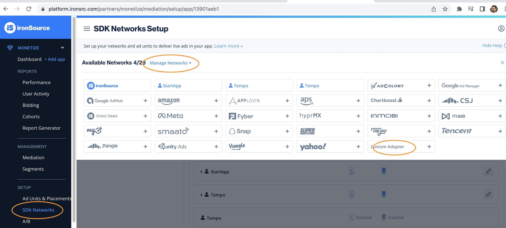
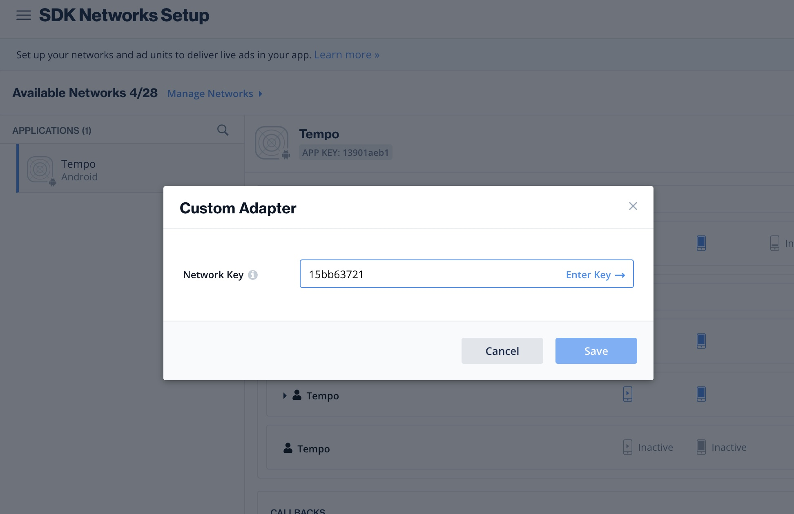
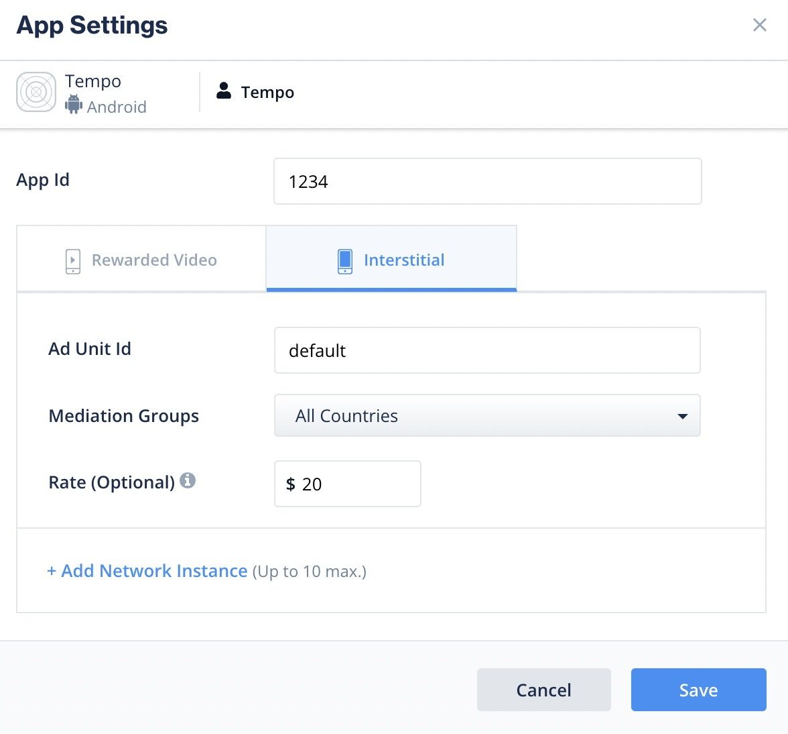
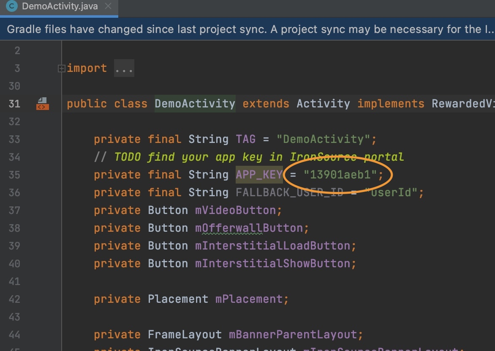

# Tempo Mediation Adapter for IronSource (Android)

## Setup Tempo

1. [Register a Publisher account][1]
2. We will email you an **Account ID** and **App ID**. You will need to use this **App ID** later in Ironsource Dashboard Custom Adapter Setup.

## Setup IronSource

1. Create a [Custom Adapter][3] in your IronSource Dashbaord by going to "SDK Networks" -> "Manage Networks" -> "Custom Adapter"
    
   
2. Enter the Network key: **15b99c96d** in the next screen
    

3. For **App Id** set the value you received in your email in Step 2. For Field **Ad Unit Id** just set value **default**.
    

## Setup project

5. Add dependency on Tempo IronSource Mediation library

```
dependencies {
    // use latest build tag 0.0.x from the github releases in this repo.
    implementation 'com.github.Tempo-Platform:tempo-android-ironsource-mediation:0.0.3'
}
```

## Testing

6. Use your IronSource **App Key** with this demo project. Put your value on [this line][4] then compile and launch.



[1]: https://www.tempoplatform.com/get-started
[3]: https://developers.is.com/ironsource-mobile/general/custom-adapter-setup
[4]: https://github.com/Tempo-Platform/tempo-android-ironsource-mediation/blob/main/app/src/main/java/com/ironsource/ironsourcesdkdemo/DemoActivity.java#L35
[5]: https://ironsrc.formtitan.com/contact-us